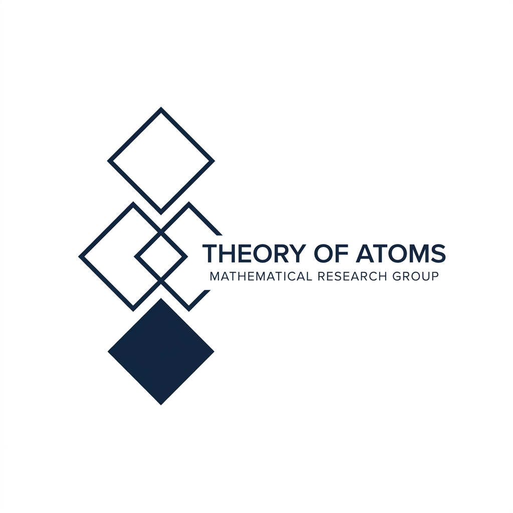

# GEOATOMS

  

Welcome to the documentation and software repository for the **GEOATOMS** mathematical research group. 

This website serves as an independent catalog and computational resource for algebraic geometry, representation theory, and enumerative geometry, specifically focusing on complete intersections in flag varieties.

## The Software: `gwflags`

The accompanying software, `gwflags`, provides a computational framework to evaluate geometric invariants using the localization technique:

- **Atiyah-Bott Localization**: Computes genus-zero Gromov-Witten invariants of flag varieties and the smooth zero loci of globally generated homogeneous vector bundles.
- **Quantum Multiplication**: Computes the small quantum multiplication matrix, its grading operators, and its eigenvalues for complete intersections.
- **Geometric Invariants**: Automatically calculates the Fano index, ambient dimension, and basis rank natively using the geometry of flag varieties.

## Navigate the Documentation

- [**About**](about.md): Learn about the team behind this project.
- [**Installation**](installation.md): Clean, step-by-step instructions for getting Python, SageMath, and `gwflags` running on Windows, macOS, and Linux.
- [**How to Use**](how-to-use.md): Practical code examples demonstrating how to use the software to compute these spaces.
- [**Methodology**](methodology.md): A concise explanation of how the software implements the localization formalism and reproduces the catalog.
- [**Catalog**](catalog.md): The expanding database of pre-computed examples and geometric invariants.

## Download

The code is hosted directly on this repository. You can explore the source code here:
- [GitHub Repository](https://github.com/leonardofcavenaghi/atomicdecompositions)
